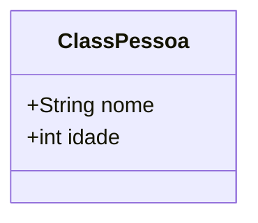

## javaOO
Principais Definições de Programação Orientada a Objetos

### Hello World
```cmd
Main.java
```
```Java
/*
A palavra Static, deixa explícito que a classe Main, é estática. Isso significa que ela pode ser chamada, pela JVM, mesmo sem ter sido instanciada.
Outro detalhe, é que a JVM, sempre irá executar, a classe Main, sendo por assim dizer, o ponto de partida para nossa aplicação.
Outro detalhe bastante importante, é que o nome da classe, deve ser igual ao nome do arquivo .java, nesse caso Main.java
*/
public class Main {//Cria uma classe, com acesso público de nome Main
    public static void main(String[] args){// Cria um método main, com visibilidade publica, void é devido ao método não ter nenhum tipo de retorno
        System.out.println("Olá Mundo");//Imprime "Olá Mundo", já direciona o cursor para a próxima linha
    }
}
```

### Criando a primeira Classe
#### Diagrama de classes


```cmd
Pessoa.java
```
```Java
/*
Na linguagem orientada a objetos, podemos fazer a analogia da classe como sendo a forma ou molde. A instância de uma classe é o sairá dessa forma
moldado pela classe.
Em uma classe, temos os métodos que representam as ações que são executadas pela classe
E os atributos representam o estado atual da classe.
É importante, ter pra si o conceito da representação do mundo real, através das classes.
Podemos representar praticamente qualquer coisa de nosso cotiano, através de uma classe.
*/
public class Pessoa {//Cria uma classe, com acesso público de nome Pessoa
    public String nome;
    public int idade;
}
```

### Criando uma instância da classe Pessoa
```cmd
Main.java
```
```Java
/*

*/
public class Main {//Cria uma classe, com acesso público de nome Main
    public static void main(String[] args){// Cria um método main, com visibilidade publica, void é devido ao método não ter nenhum tipo de retorno
        Public Pessoa pessoa = new Pessoa();// Cria uma instância (objeto) da classe pessoa
        pessoa.nome = "João"; // Atribui um nome
        pessoa.idade = 18; // Atribui uma idade
        System.out.println("O nome da pessoa é : " + pessoa.nome + "e a idade é: " + pessoa.idade);
    }
}
```
